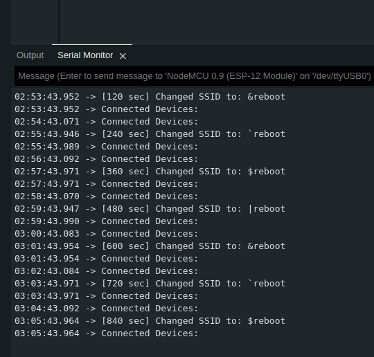
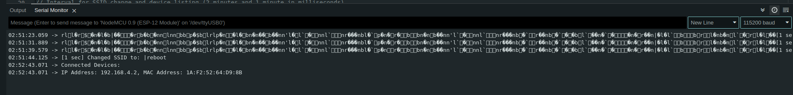

<p align="center">
  <strong>CommandInWiFi</strong>
</p>

<p align="center">
  
</p>

<p align="center">
  Investigating Command Injection Flaws in WiFi Access Point Storage , This project inspired by zero-click attacks.
</p>


-------------------------------
### Disclaimer 
- Purpose of the Code: If this code is for testing or educational purposes, ensure it's used ethically and legally.
- IoT Security Testing: As an IoT Security Engineer, using such a setup could be part of a penetration testing toolkit to assess how devices behave under different network conditions.

### Description :
This code is designed to interact with Wi-Fi SSIDs stored on client devices. It is common knowledge that devices save Wi-Fi SSIDs internally, and understanding how they store and discover these SSID names is crucial. 

From my observations, some devices allow SSID names to be used as carriers for payloads. In scenarios where devices lack proper security, these payload-bearing SSIDs can be executed at the bash level. The reaction of a device to specific payloads is key here. If a device interprets a payload as a command, it can range from causing Denial of Service (DoS) to  Remote Code Execution (RCE). This includes actions like opening ports for unauthorized access, which can significantly impact Wi-Fi network-based IoT devices. 

My code specifically targets this vulnerability by forcing the device to reboot whenever it encounters an SSID that carries a predetermined payload. This approach demonstrates the potential impacts and risks associated with how devices handle SSID names. 

| Status | Condition                                                         |
|--------|-------------------------------------------------------------------|
| SAFE   | Device does not reboot.  |
| UNSAFE | Device reboots when it finds an SSID or at user-selected intervals. |

-----------------------------------
#### Target Devices Vulnerable to Zero-Click Attacks

| S.No | Description of Vulnerable Devices | Level of Impact Risk |
|------|-----------------------------------|----------------------|
| 1.   | Devices that automatically join open Wi-Fi networks or execute payloads during network discovery | Zero-Click |
| 2.   | Devices that read SSIDs and interpret them as commands at the bash level | Critical |
| 3.   | Devices that store data in a format which inadvertently executes code | Low Risk |

------------------------------------
#### PoC:





--------------------------------
```[tasklist]
### todo
- [ ] Convert code into python3
- [ ] add function for discovering vulnerable device or not
- [ ] Document it
- [ ] Add vulnerable source code
- [ ] payload list
- [ ] Adding UI
- [ ] Add other testcases
    - [ ] OS Command injection active payloads for IoT Devices
```
----------------------------------
#### Referral Links

- [What is Zero-Click Malware? - Kaspersky](https://www.kaspersky.com/resource-center/definitions/what-is-zero-click-malware)
- [Meet WiFiDemon: iOS WiFi RCE 0-Day Vulnerability - ZecOps Blog](https://blog.zecops.com/research/meet-wifidemon-ios-wifi-rce-0-day-vulnerability-and-a-zero-click-vulnerability-that-was-silently-patched/)
- [What is a Zero-Click Attack? - Check Point](https://www.checkpoint.com/cyber-hub/cyber-security/what-is-a-zero-click-attack/)
- [Apple Quietly Patched 0-Click Wi-Fi Code Execution Vulnerability - SecurityWeek](https://www.securityweek.com/researchers-apple-quietly-patched-0-click-wi-fi-code-execution-vulnerability-ios/)
- [Marvell Avastar Wi-Fi Vulnerability - Help Net Security](https://www.helpnetsecurity.com/2019/01/21/marvell-avastar-wi-fi-vulnerability/)
- [OS Command Injection - PortSwigger](https://portswigger.net/web-security/os-command-injection)

