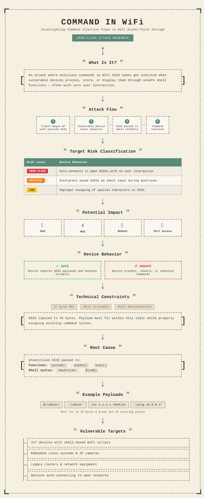
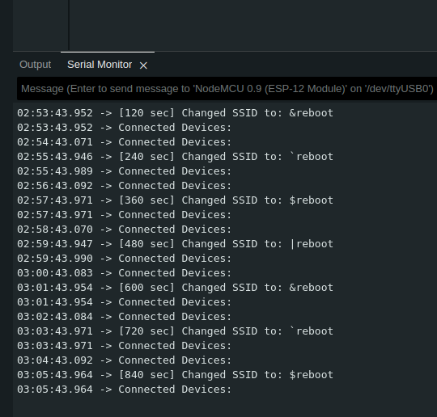
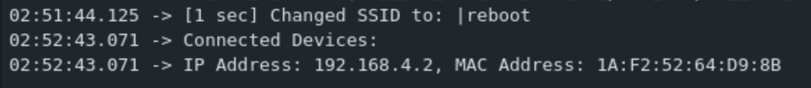

<p align="center">
  
</p>

<h1 align="center">CommandInWiFi</h1>
<p align="center"><strong>Zero-Click SSID Command Injection Framework</strong></p>
<p align="center">
  
  
  
  
</p>

---

## Disclaimer

> **For authorized security testing and research only.**
> This tool is designed for IoT security professionals to evaluate device behavior under abnormal WiFi SSID input conditions. Use ethically, legally, and only on devices you own or have written authorization to test.

---
## Research Note


> As part of this work, no direct RCE payloads have been added to the framework.
>
> CommandInWiFi currently focuses on SSID parsing instability, crash detection, reboot detection, and behavioral anomaly analysis , not confirmed remote code execution.
>
> If a validated RCE-class payload were ever introduced and responsibly proven in a controlled environment, that would satisfy the strict definition of zero-click exploitation. Until then, detection does not equal exploitation.
>
> This project maintains a clear ethical boundary: no weaponized payloads, no operational exploit chains, no service-enabling commands.
>
> As the project supports custom commands, researchers may add their own logic independently.
>
> Hints and research direction purpose only .
>
> Hunt beyond limits.

---
## Payloads
> I am still working on in-depth of whatever i have provided payloads , like overflow payloads still need to do more study on them,once i got to how they are working on target side payloads may get change in future

---


## What It Does

CommandInWiFi broadcasts crafted WiFi SSIDs from an ESP32/ESP8266 to test how nearby IoT devices handle malicious SSID names. Vulnerable firmware may:

- **Crash or reboot** when parsing a poisoned SSID
- **Execute commands** if SSID text reaches a shell/system call
- **Leak memory** via format string specifiers in SSID
- **Corrupt config files** via serialization injection in stored SSIDs

The tool includes a **web dashboard** for managing payloads, flashing firmware, monitoring serial output, real-time device tracking, automated vulnerability detection, and recording test results - all from your browser.

[](https://www.youtube.com/watch?v=XOZeVIV16Os)

<p align="center">
  
</p>


---

## Architecture Workflow

```
+-----------------------------------------------------------------------+
|                        COMMANDINWIFI SYSTEM                           |
+-----------------------------------------------------------------------+

                    +---------------------------+
                    |     Web Dashboard         |
                    |     (Browser UI)          |
                    |                           |
                    |  +-----+ +------+ +----+  |
                    |  | Pay | | Seri | | Re |  |
                    |  | loa | | al   | | su |  |
                    |  | ds  | | Mon  | | lt |  |
                    |  +-----+ +------+ +----+  |
                    +---------|-----|-----------+
                     REST API |     | WebSocket
                     (HTTP)   |     | (ws://serial)
                              v     v
                    +---------------------------+
                    |     FastAPI Backend       |
                    |     (dashboard/app.py)    |
                    |                           |
                    |  +----------+ +--------+  |
                    |  | SQLite   | | Serial |  |
                    |  | Database | | Manager|  |
                    |  | (CRUD)   | | (I/O)  |  |
                    |  +----------+ +--------+  |
                    +--------------|-------------+
                                  | USB Serial (115200 baud)
                                  | CIW Protocol (line-based)
                                  v
                    +---------------------------+
                    |   ESP32 / ESP8266         |
                    |   (CommandInWiFi.ino)     |
                    |                           |
                    |   WiFi AP Mode            |
                    |   CIW Protocol Handler    |
                    +---------------------------+
                                |
                  Beacon Frames |
                  (Malicious    |
                   SSIDs)       |
                                v
                    +---------------------------+
                    |    Target IoT Devices     |
                    |                           |
                    |  Scan WiFi -> Parse SSID  |
                    |  Connect -> Process SSID  |
                    |                           |
                    |  Possible outcomes:       |
                    |  - Crash / Reboot         |
                    |  - Command Execution      |
                    |  - Memory Leak            |
                    |  - Config Corruption      |
                    +---------------------------+
```

---

## Data Flow Diagram

```
+-------------------+        +-------------------+        +-------------------+
|   PAYLOAD DEPLOY  |        |   SSID BROADCAST  |        |  VULN DETECTION   |
+-------------------+        +-------------------+        +-------------------+

Dashboard                     ESP Firmware                  Serial Manager
    |                             |                             |
    | 1. Select payloads          |                             |
    | 2. Click "Deploy"           |                             |
    |                             |                             |
    |--- POST /api/deploy ------->|                             |
    |                             |                             |
    | 3. CIW:CLEAR                |                             |
    |--- serial write ----------->|                             |
    |                             | CIW:OK:CLEAR                |
    |<--- serial read ------------|                             |
    |                             |                             |
    | 4. CIW:ADD:<base64>         |                             |
    |--- serial write ----------->|                             |
    |    (for each payload)       | CIW:OK:ADD:<index>          |
    |<--- serial read ------------|                             |
    |                             |                             |
    | 5. CIW:START                |                             |
    |--- serial write ----------->|                             |
    |                             | CIW:OK:START:<count>        |
    |<--- serial read ------------|                             |
    |                             |                             |
    |                             | 6. WiFi.softAP(ssid)        |
    |                             |--- broadcast SSID --------->|
    |                             |                             |
    |                             | CIW:SSID:<current_ssid>     |
    |<--- serial read ------------|--- track SSID change ------>|
    |                             |                             |
    |                             | 7. Target connects to AP    |
    |                             |                             |
    |                             | CIW:STA_CONNECT:<mac>|<ssid>|
    |<--- serial read ------------|--- log connect time ------->|
    |                             |                             |
    |                             | 8. Target disconnects       |
    |                             |                             |
    |                             | CIW:STA_DISCONNECT:<mac>    |
    |<--- serial read ------------|--- analyze timing --------->|
    |                             |                      duration < 10s?
    |                             |                      = possible crash
    |                             |                             |
    |                             |              CRASH alert -->|
    |                             |              via WebSocket  |
    |<--- ws://serial ------------|<----------------------------|

```

---

## Vulnerability Detection Workflow

```
                        +------------------+
                        | ESP Broadcasts   |
                        | Malicious SSID   |
                        +--------+---------+
                                 |
                                 v
                    +------------------------+
                    | Target device connects |
                    | to malicious AP        |
                    +--------+---------------+
                             |
                    CIW:STA_CONNECT:<mac>|<ssid>
                    Serial Manager logs connect time
                             |
                             v
                    +------------------------+
                    | Target disconnects     |
                    +--------+---------------+
                             |
                    CIW:STA_DISCONNECT:<mac>|<ssid>
                             |
                     +-------+-------+
                     |               |
                     v               v
              +-----------+   +--------------+
              | duration  |   | duration     |
              | < 10s     |   | >= 10s       |
              +-----------+   +--------------+
                     |               |
                     v               v
              +-----------+   +--------------+
              | SSID just |   | Normal       |
              | rotated?  |   | disconnect   |
              | (< 5s)    |   | (no alert)   |
              +-----+-----+   +--------------+
                    |
              +-----+-----+
              | NO        | YES
              v           v
        +-----------+ +--------------+
        | CRASH     | | Filtered     |
        | DETECTED  | | (false       |
        |           | |  positive)   |
        +-----------+ +--------------+
              |
              v
        +-------------------+
        | Cooldown check    |
        | (30s per MAC)     |
        +--------+----------+
                 |
                 v
        +-------------------+
        | Alert shown in    |
        | Vuln Alerts panel |
        | Save to Results   |
        +-------------------+
```

---

## Features

- **95 payloads** across 9 attack categories (pre-loaded)
- **Web Dashboard** - manage payloads, deploy to ESP, monitor serial, record results
- **One-Click Flash** - compile and flash firmware to ESP32/ESP8266 from the dashboard
- **Board Selection** - choose target board (ESP32 or ESP8266) before flashing
- **Real-Time Serial Monitor** - see CIW protocol messages, deploy progress, ESP output live
- **Real-Time Device Tracking** - see devices connecting/disconnecting from the malicious AP
- **Automated Vulnerability Detection** - time-based crash detection
  - Quick disconnect detection (device disconnects within 10 seconds of connecting)
  - False-positive filtering (SSID rotation disconnects excluded)
  - Per-device cooldown (30s) to prevent alert spam from crash-looping devices
- **Auto-Save Results** - detected vulnerabilities can be saved directly to the results database
- **Results Matrix** - track which payloads crash/reboot which devices
- **CIW Protocol** - custom serial protocol for remote payload deployment
- **Open AP** - SSIDs broadcast without password for maximum visibility
- **Cross-Platform Firmware** - single codebase supports both ESP32 and ESP8266

---

## Project Structure

```
CommandInWiFi-Zeroclick/
├── CommandInWiFi.ino          # ESP firmware (Arduino, ESP32 + ESP8266)
├── platformio.ini             # PlatformIO build config (both boards)
├── src/
│   └── CommandInWiFi.ino      # Symlink for PlatformIO build
├── code-python/
│   ├── micrypython-ciw.py     # MicroPython firmware (alternative)
│   └── install.sh             # MicroPython flash helper
├── dashboard/
│   ├── __init__.py
│   ├── app.py                 # FastAPI backend (REST + WebSocket)
│   ├── database.py            # SQLite schema + 95 default payloads
│   ├── serial_manager.py      # Serial I/O, deploy, flash, vuln detection
│   ├── requirements.txt       # Python dependencies
│   ├── templates/
│   │   └── index.html         # Dashboard HTML
│   └── static/
│       ├── app.js             # Dashboard frontend logic
│       └── style.css          # Dark theme styles
├── poc/                       # Proof-of-concept screenshots
├── LICENSE                    # MIT License
```

---

## Quick Start

### Requirements

- **Hardware**: ESP32 or ESP8266 board (NodeMCU, DevKit, etc.) + USB cable
- **Software**: Python 3.10+, pip

### 1. Clone and Setup

```bash
git clone https://github.com/AsciiHusky/CommandInWiFi-Zeroclick.git
cd CommandInWiFi-Zeroclick

python3 -m venv .venv
source .venv/bin/activate       # Linux/macOS
# .venv\Scripts\activate        # Windows

pip install -r dashboard/requirements.txt
```

### 2. Start Dashboard

```bash
uvicorn dashboard.app:app --host 0.0.0.0 --port 8000
```

Open **http://localhost:8000** in your browser.

### 3. Flash Firmware (from Dashboard)

1. Plug in your ESP via USB
2. Go to **Serial Monitor** tab
3. Select your serial port (e.g. `/dev/ttyUSB0`)
4. Choose board type: **ESP32** or **ESP8266**
5. Click **Flash Firmware**
6. Watch compilation and flash progress in real-time

### 4. Deploy Payloads

1. Go to **Payloads** tab
2. Select payloads (click rows or use Select All)
3. Click **Deploy Selected**
4. Dashboard switches to Serial Monitor - watch the ESP receive and broadcast

### 5. Monitor and Detect Vulnerabilities

- **Serial Monitor** - see live ESP output (SSID changes, device events)
- **Connected Devices** panel - real-time list of devices on the malicious AP
- **Vulnerability Alerts** panel - automatic crash detection (quick disconnect < 10s)
- **Results Matrix** - record which payloads cause crashes/reboots on target devices

---

## Payload Categories

| Category | Count | Description |
|----------|-------|-------------|
| `wifi_cmd` | 20 | Shell command injection via pipe, backtick, semicolon, subshell |
| `wifi_overflow` | 10 | Buffer overflow / boundary fuzzing (32-byte SSID limit) |
| `wifi_fmt` | 15 | Format string attacks (`%s`, `%n`, `%x` for crash/leak/write) |
| `wifi_probe` | 10 | Malformed SSIDs (null bytes, control chars, Unicode edge cases) |
| `wifi_esc` | 8 | Terminal/log escape injection (ANSI codes in SSID) |
| `wifi_serial` | 8 | Serialization injection (JSON/XML/SQL/template in SSID) |
| `wifi_enc` | 8 | Encoding normalization attacks (fullwidth Unicode, URL-encode) |
| `wifi_chain` | 8 | Multi-SSID chain attacks (split payload across sequential SSIDs) |
| `wifi_heap` | 8 | Memory corruption primitives (heap metadata, canary patterns) |

---

## CIW Serial Protocol

The dashboard communicates with the ESP via a line-based serial protocol:

### Commands (Dashboard -> ESP)

| Command | Description |
|---------|-------------|
| `CIW:CLEAR` | Clear payload queue |
| `CIW:ADD:<base64>` | Add payload (base64-encoded SSID) |
| `CIW:START` | Start broadcasting queued payloads |
| `CIW:STOP` | Stop broadcasting |
| `CIW:STATUS` | Request current status |

### Responses (ESP -> Dashboard)

| Response | Description |
|----------|-------------|
| `CIW:BOOT` | ESP has booted and is ready |
| `CIW:OK:CLEAR` | Queue cleared successfully |
| `CIW:OK:ADD:<index>` | Payload added at queue index |
| `CIW:OK:START:<count>` | Broadcasting started with N payloads |
| `CIW:OK:STOP` | Broadcasting stopped |
| `CIW:STATUS:<state>:<count>:<index>` | Current state, payload count, SSID index |
| `CIW:SSID:<ssid_text>` | Currently broadcasting this SSID |
| `CIW:STA_CONNECT:<mac>\|<ssid>` | Device connected to AP |
| `CIW:STA_DISCONNECT:<mac>\|<ssid>` | Device disconnected from AP |
| `CIW:DEVICE:<ip>\|<mac>` | Periodic device list entry |

---

## Vulnerability Detection

### How It Works

CommandInWiFi detects vulnerable devices using **time-based crash detection** (works on both ESP32 and ESP8266):

**1. Quick Disconnect Detection**

When a device connects to the malicious AP and disconnects within a short threshold (< 10 seconds), this suggests the device crashed while processing the SSID after connection.

```
Device connects -> Processes SSID -> Crashes -> Disconnects (< 10s)
                                                 ^^^ CRASH detected
```

**2. False Positive Filtering**

When the ESP rotates to a new SSID (via `WiFi.softAP()`), all connected stations are forcibly disconnected. These expected disconnects are filtered out by tracking SSID change timestamps and ignoring disconnects within a 5-second window.

**3. Per-Device Cooldown**

To prevent alert spam from devices stuck in a crash-reboot loop, a 30-second cooldown is applied per MAC address. The same device won't trigger duplicate alerts within this window.

---

## Dashboard API

| Method | Endpoint | Description |
|--------|----------|-------------|
| `GET` | `/api/payloads` | List payloads (optional `?category=` filter) |
| `POST` | `/api/payloads` | Create payload |
| `PUT` | `/api/payloads/{id}` | Update payload |
| `DELETE` | `/api/payloads/{id}` | Delete payload |
| `GET` | `/api/results` | List all results (optional `?device_name=` filter) |
| `GET` | `/api/results/matrix` | Get device vs payload results matrix |
| `POST` | `/api/results` | Record test result |
| `GET` | `/api/serial/ports` | List available serial ports |
| `POST` | `/api/serial/connect` | Connect to serial port |
| `POST` | `/api/serial/disconnect` | Disconnect serial |
| `GET` | `/api/serial/status` | Get serial connection status |
| `POST` | `/api/deploy` | Deploy selected payloads to ESP |
| `POST` | `/api/deploy/stop` | Stop ESP broadcasting |
| `GET` | `/api/deploy/status` | Get deploy status |
| `GET` | `/api/devices` | Get connected devices and vuln events |
| `POST` | `/api/devices/save-result` | Auto-save detected vulnerability to results DB |
| `POST` | `/api/firmware/flash` | Compile and flash firmware (with board selection) |
| `WS` | `/ws/serial` | Real-time serial monitor WebSocket |

---

## MicroPython Alternative

For ESP32 boards running MicroPython instead of Arduino:

```bash
cd code-python
# Edit install.sh with your port
bash install.sh

# Then upload the script
ampy --port /dev/ttyUSB0 put micrypython-ciw.py main.py
```

The MicroPython version supports the same CIW protocol and works with the dashboard.

---

## Proof of Concept

<p align="center">
  
</p>
<p align="center"><em>ESP broadcasting crafted SSIDs - visible in WiFi scanner</em></p>

<p align="center">
  
</p>
<p align="center"><em>Target device crashes/reboots when exposed to malicious SSID</em></p>

---

## Troubleshooting

| Issue | Fix |
|-------|-----|
| No serial ports found | Check USB connection, install CP2102/CH340 drivers |
| Flash fails | Close Arduino IDE / other serial monitors (only one app can use the port) |
| ESP shows factory SSID | Flash the CommandInWiFi firmware first via Dashboard |
| `pio not found` error | Run `pip install platformio` in your venv |
| Permission denied on port | `sudo chmod 666 /dev/ttyUSB0` or add user to `dialout` group |
| Ubuntu can't find NodeMCU | `sudo apt remove brltty` (conflicts with USB serial) |
| False vuln alerts | Expected during SSID rotation. System filters disconnects within 5s of SSID change |

---

## References

- [Zero-Click WiFi Attacks (Kaspersky)](https://www.kaspersky.com/resource-center/definitions/what-is-zero-click-malware)
- [WiFiDemon iOS 0-day (ZecOps)](https://blog.zecops.com/research/meet-wifidemon-ios-wifi-rce-0-day-vulnerability-and-a-zero-click-vulnerability-that-was-silently-patched/)
- [Marvell Avastar WiFi RCE](https://www.helpnetsecurity.com/2019/01/21/marvell-avastar-wi-fi-vulnerability/)
- [OS Command Injection (PortSwigger)](https://portswigger.net/web-security/os-command-injection)
- [CVE-2023-45866 Bluetooth Zero-Click](https://github.com/marcnewlin/hi_my_name_is_keyboard)

---

## License

MIT License - see [LICENSE](LICENSE)
