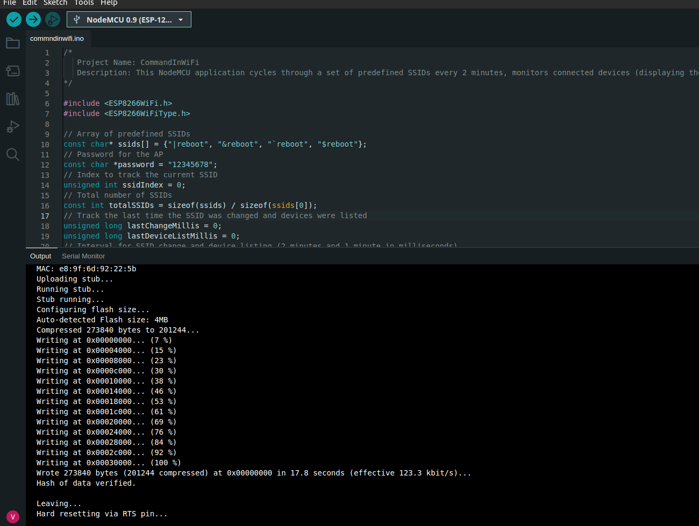

#### 1. Hardware Setup
Ensure you have:
- A NodeMCU ESP8266 board.
- A USB cable for connection.
- A computer with Arduino IDE installed.

#### 2. Arduino IDE Setup
- **Install Arduino IDE**: Download from [Arduino website](https://www.arduino.cc/en/Main/Software).
- **Add ESP8266 Board**:
  - Open Arduino IDE.
  - Go to `File > Preferences`.
  - Add URL: `http://arduino.esp8266.com/stable/package_esp8266com_index.json`.
  - Install ESP8266 via `Tools > Board > Boards Manager`.
- **Select Your Board**:
  - `Tools > Board` and select "NodeMCU 1.0 (ESP-12E Module)".
- **Choose Correct Port**:
  - `Tools > Port` and select your NodeMCU's COM port.

#### 3. Loading the Code
- **Open New Sketch**:
  - `File > New` in Arduino IDE.
- **Copy-Paste Code**:
  - Copy provided NodeMCU code.
  - Paste into Arduino IDE sketch.

#### 4. Customizing the Code
- Modify SSID and password as needed.

#### 5. Uploading the Code
- **Compile and Upload**:
  - Click "Upload" in Arduino IDE.
  - Wait for completion message.

#### 6. Monitoring and Debugging
- **Open Serial Monitor**:
  - `Tools > Serial Monitor`.
  - Match baud rate with your code (commonly `115200`).

#### 7. Testing and Iteration
- **Test Functionality** and iterate as needed.

  

#### 8. Safety and Legal Concerns
- **Handle with Care**: Disconnect power when adjusting connections.
- **Legal Compliance**: Ensure compliance with laws and regulations.

-----------------
#### Note for Ubuntu 22.04 Users: Ensuring NodeMCU Discovery

To ensure your laptop can discover the NodeMCU via USB in the Arduino IDE:
  
  **Remove Conflicting Packages**:
   - Ubuntu 22.04 may have `brltty` installed, which can interfere with USB recognition. Remove it using:
   `
   sudo apt remove brltty
   `
